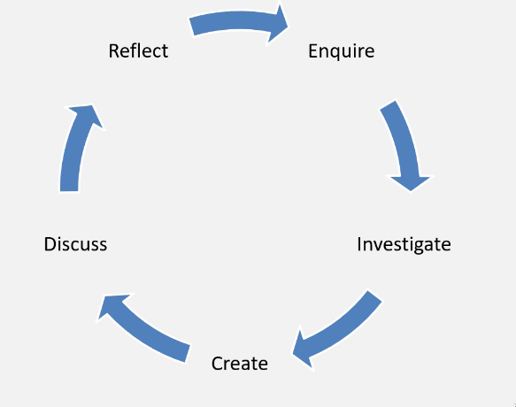

# Critical Thinking

## What is critical thinking?

* Helps create strong arguments by justifying claims with evidence
* Can contribute to any role as it requires the ability to gather information, analyse it and evaluate it
* TRY GET THE 'TRUTH'

## Critical Thinking Skills
* Actively seeking out all sides of the arguments
* Checking the facts
* Responding objectively

## Levels of Intellectual Skills
* Thinking triangle, Benjamin Blooms
	* Six levels of thinking skills

## Critical thinking Process
3 steps:
* **Identify:**
	* Main points of argument
	* The claims being made
	* The evidence that is being used
	* The conclusions reached
* **Analyse** (by asking the following):
	* Does information make sense in relation to other research?
	* How old is the research?
	* Is the material clear, or is more needed to aid understanding?
	* Does the argument present a balanced view or are some topics diregarded?
* **To apply and compare** (looking out for):
	* The implications of the other information
	* Weaknesses when applied to a real-life situation
	* A lack of coverage

## 3 Modes of Thinking
//TODO look over these more
* **Divergent:**
	* Question → Idea
* **Convergent:**
	* Facts → Answer
* **Lateral:**
	* Uses both of the previous ones

## Six Thinking Hats
Developed as a parallel thinking process, see _Communication.md_ for more details about the hats. When to apply each of the hats is purely situational.

## Incorrect Attitudes
* **Ignorant Certainty:**
	* The belief that there are definite answers to all questions
* **Naive Relativism:**
	* The belief that there is no trurth and all arguments are equal

## Enquiry-Based Learning
A way of learning that is based upon asking questions.

### The Enquiry Cycle

**What kinds of questions might we ask when thinking critically?:**
* What is the source of the evidence?
* What kinds of claims are being made?
* Where is the evidence for these claims?
* What are the strenghts and weaknesses?
* How clear are the points?
* Is it a balanced argument?
* Are there any underlying themes?
* Do we understand the background?
* Are the examples good?
* etc.

## What is an argument?

### Basic Argument Structure
* **Claim:**
	* Present your argument within a clear statement
* **Evidence:**
	* Present evidence to support your claim
* **Impact:**
	* Explain the significance of the evidence .i.e. how does it support your claim?

### Evaluate an argument
Consider the following:
* Do the claims make logical sense?
* Are the claims based on opinion or supported with evidence?
* Are any assumptions made?
* Have all alternatives been considered?
* Does the evidence support all the claims made?
* Is the evidence appropriate for the topic?
* etc.

### Challenging an argument?
Debating etiquette:
* Acknowledge the other person's view before challenging it
* Be constructive rather than simple dismissing the other person's point of view
* Reflect on the strengths of the other person's argument
* Respectful, language used etc

#### Objective Phrasing
Try using objective phrasing like "It could be argued that..." rather than "I think".

#### Logical Fallacies
Look out for logical fallacies such as false dichotomy, false equivalence, assertion, no true Scotsman, appeal to authority etc.
See the poster below to see the most common ones:

## The Art Of Persuasion
### The Three Pillars of Rhetoric
* **Ethos** - Appealing through authority or credibility
* **Pathos** - Appealing through emotional empathy
* **Logos** - Appealing through logic and reasoning

## Important Skills for Debating
DO:
* Be prepared
* Stay calm
* Speak clearly and confidently
* Keep language simple
* Active listening

DON'T:
* Falsify or alter evidence
* Publicly disagree with the decision
* _Ad hominem_
* Act aggressively or offensively
* Interrupt others
* Disagree with facts or obvious truths

