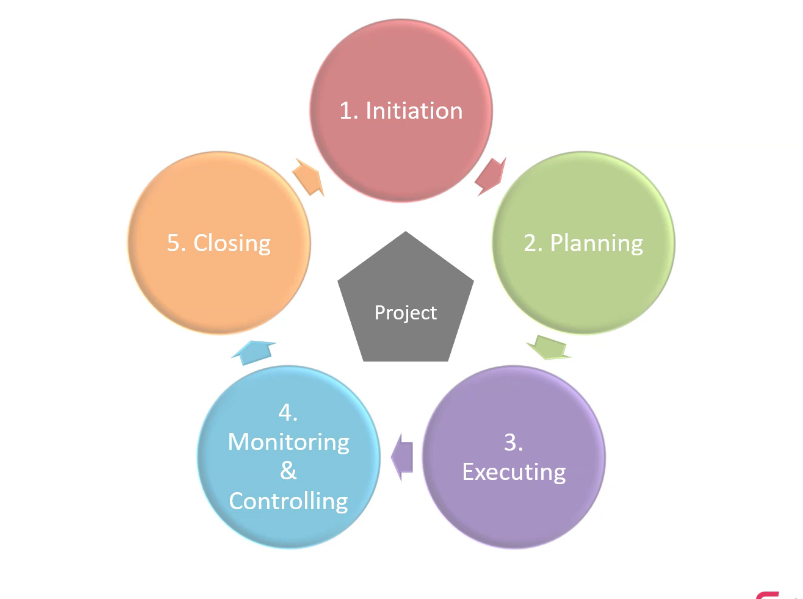
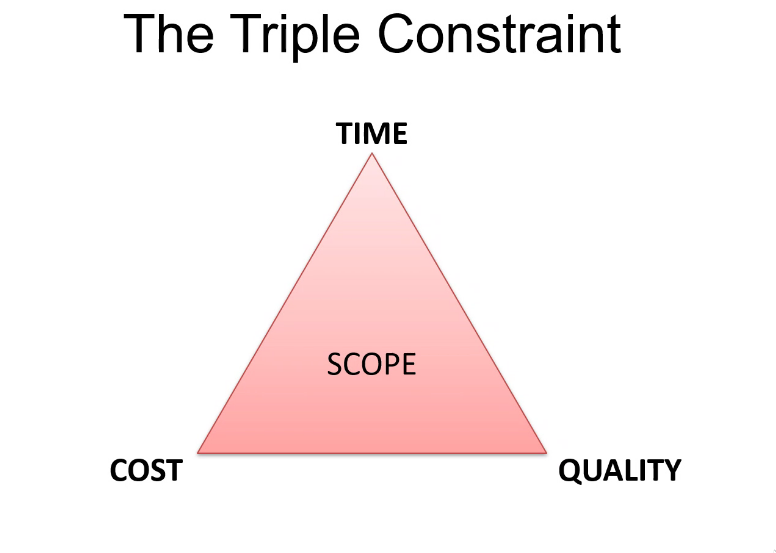
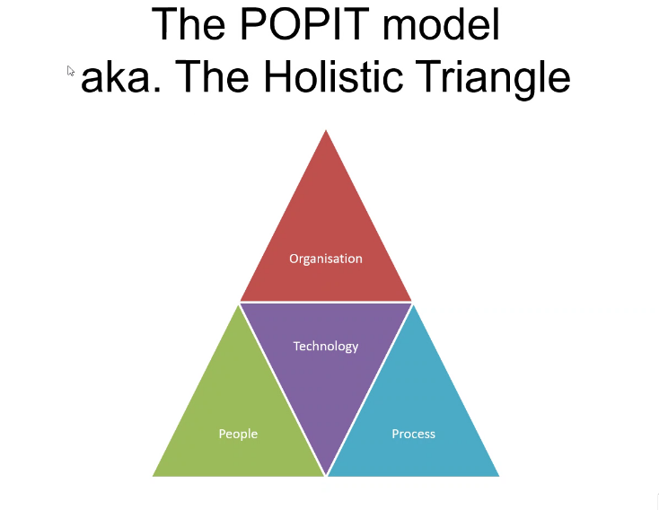
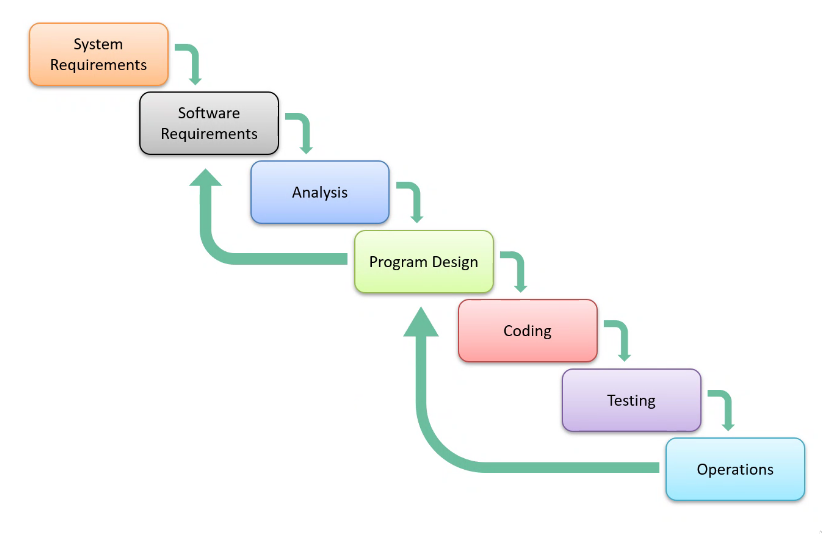
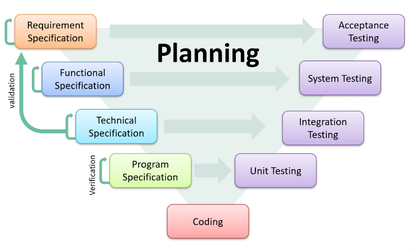
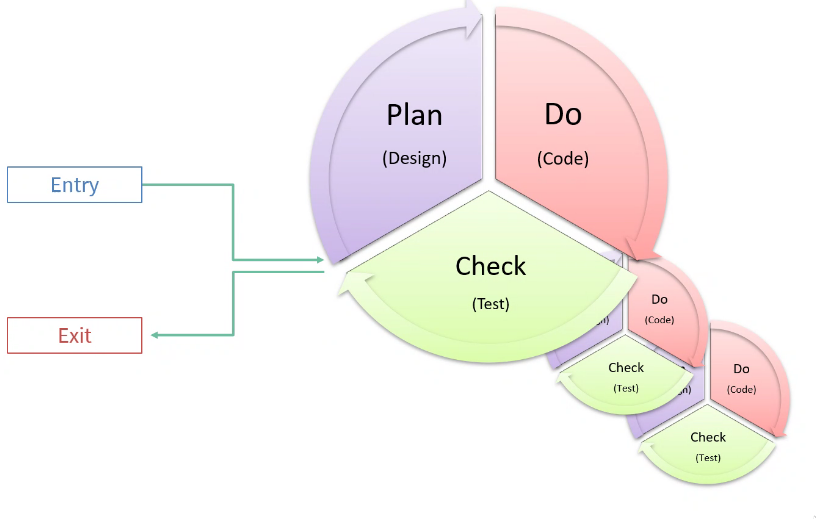
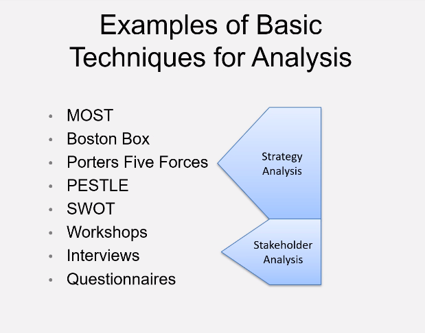
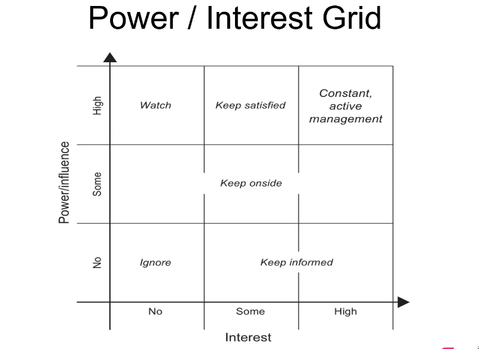

# Project Environments

## BAU vs Project

* Business as usual, standard day to day stuff.
* A project is unique and transient with a desired outcome.

Each project can be completely separate from BAU

## Software Development Lifecycles
* Waterfall

* V-Model

* Agile (currently trending)
 

 * SCRUM framework works well within the Agile model
	* Way of timeboxing and planning what things to do and see what have been done, basically time management

## Management Plans and SDLCs (Software Development Life Cycle)

## Attributes of Mature Teams
* Co-located
* Cross Functional Roles
	* .e.g. DevOps bridging the gap between the development and operations teams
* Self-organising
* Accountable and Empowered
* Test and learn feedback loops .e.g. unit tests

## Making A Project Run Better
* Create a positive atmosphere
* Manage conflict intelligently
* Have open and clear communication
* Respect all of your peers
* Become trustworthy

## Essential Project Knowledge
* **Business Case**:
	* Expected benefits and disadvantages
	* Execution timeline
	* Executive summary
	* Investment appraisal
	* Solutions/Options
	* Major Risks
	* Stakeholders/Communication Plan

* Examples of Basic Techniques for Analysis:
 

**All risks are based on ROI (return on investment)**

## What Is Risk?

* **Some sources of risk**:
	* Technology
	* Team
	* Scope
	* Business
	* Economy
	* Competition

* **Dealing with risks**:
	* Avoidance
	* Transfer
	* Reduce
	* Accept
	* Exploit
	* Share
	* Enhance
		* Modify risk exposure
	* Ignore
		* Bad idea

## Stakeholders

Include:
* Partners
* Suppliers
* Regulators
* Employees
* Managers
* Owners
* Competitors
* Customers

See below for a power/interest grid which can show which stakeholders will be most actively involved in a project based upon how much power they have:

### Stakeholder Attitudes
* Champion
	* Will fight for the cause
* Supporter
* Neutral
* Critic
* Opponent
	* Against the project
* Blocker
	* Actively against the project and try get it stopped

